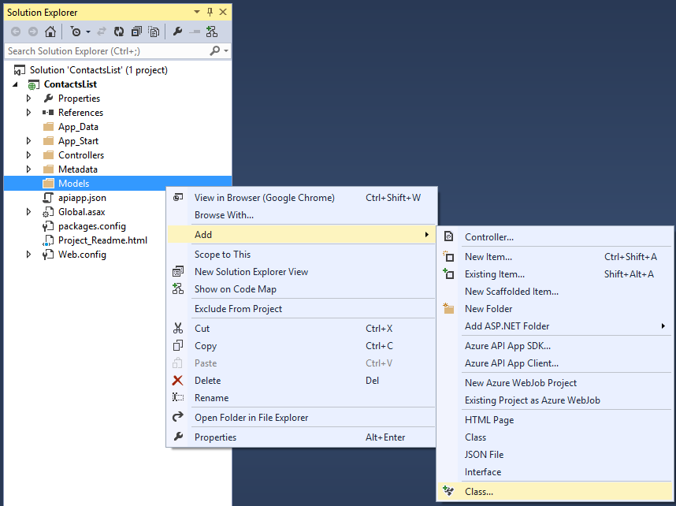
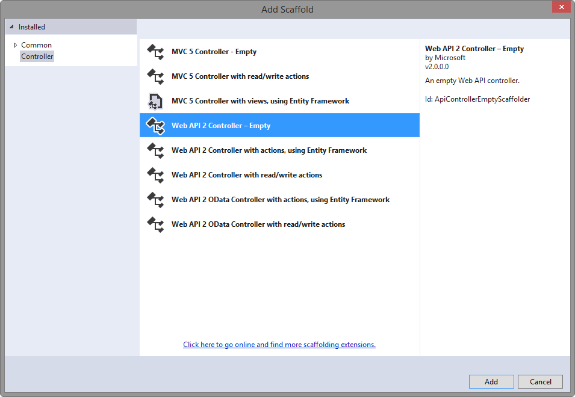
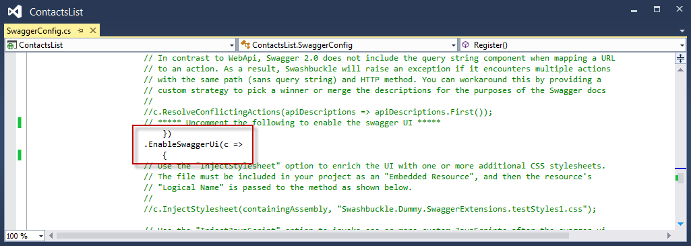

Creating and Consuming an API App Instance
=======================================================================================

In a mobile first, cloud first world, companies need to ensure their customers, partners and employees are able to seamlessly connect with and consume data across anywhere and on any device. As a developer, you need to build applications that support multiple platforms, can integrate with on-premises information systems and cloud-based services as well as automatically scale globally as your business and audience grow.

Focused on rapid development of web and mobile apps, as well as automating business processes, Azure App Service provides an integrated set of enterprise capabilities through a single development and management experience offering.  An API app is an App Service web app with additional features that enhance the experience of developing, deploying, publishing, consuming, managing, and monetizing RESTful web APIs.  API Apps makes it easy to connect your applications to popular SaaS platforms and custom code.  An API app is an App Service web app with additional features that enhance the experience of developing, deploying, publishing, consuming, managing, and monetizing RESTful web APIs.

In this lab, you will be introduced to the developer experience for App Service API Apps.

This lab includes the following tasks:

* [Create an API App Project](#create-project)
* [Add Web API Logic](#add-code)
* [Test the Web API](#test-api)

## Create an API App Project

In this task you will create the web application that is going to be used throughout this lab.

1. Open Visual Studio. From the **File** menu, hover over the **New** option and click **Project**.

	

    _New Project in File menu_

2. In the **New Project** dialog box, expand **C#** and select **Web** under **Installed Templates**, and then select **ASP.NET Web Application**.

3. Name the application **ContactsList** and click **OK**.

	

    _New Project dialog box_

4. In the **New ASP.NET Project** dialog, select the **Azure API App (Preview)** project template.

	

    _New API App_

	>**Note:** Visual Studio creates a Web API project configured for deployment as an API app.

5. The metadata that enables a Web API project to be deployed as an API app is contained in an *apiapp.json* file and a *Metadata* folder.

	

    _Solution Explorer_

 	> The default contents of the *apiapp.json* file resemble the following example:

			{
			    "$schema": "http://json-schema.org/schemas/2014-11-01/apiapp.json#",
			    "id": "ContactsList",
			    "namespace": "microsoft.com",
			    "gateway": "2015-01-14",
			    "version": "1.0.0",
			    "title": "ContactsList",
			    "summary": "",
			    "author": "",
			    "endpoints": {
			        "apiDefinition": "/swagger/docs/v1",
			        "status": null
			    }
			}

## Add Web API Logic

In this task you will add code for a simple HTTP Get method that returns a hard-coded list of contacts.  You will also enable the Swagger UI component.

1. In Solution Explorer, right-click the **Models** folder and select **Add > Class**.

	

2. Name the new file *Contact.cs*.

	

3. Click **Add**.

4. Once the *Contact.cs* file has been created, replace the entire contents of the file with the following code.

		namespace ContactsList.Models
		{
			public class Contact
			{
				public int Id { get; set; }
				public string Name { get; set; }
				public string EmailAddress { get; set; }
			}
		}

5. Right-click the **Controllers** folder, and select **Add > Controller**.

	

6. In the **Add Scaffold** dialog, select the **Web API 2 Controller - Empty** option, and click **Add**.

	

7. Name the controller **ContactsController**, and click **Add**.

	

8. Once the **ContactsController.cs** file has been created, replace the entire contents of the file with the following code.

		using ContactsList.Models;
		using System;
		using System.Collections.Generic;
		using System.Linq;
		using System.Net;
		using System.Net.Http;
		using System.Threading.Tasks;
		using System.Web.Http;

		namespace ContactsList.Controllers
		{
		    public class ContactsController : ApiController
		    {
		        [HttpGet]
		        public IEnumerable<Contact> Get()
		        {
		            return new Contact[]{
						new Contact { Id = 1, EmailAddress = "barney@contoso.com", Name = "Barney Poland"},
						new Contact { Id = 2, EmailAddress = "lacy@contoso.com", Name = "Lacy Barrera"},
	                	new Contact { Id = 3, EmailAddress = "lora@microsoft.com", Name = "Lora Riggs"}
		            };
		        }
		    }
		}

	> By default, API App projects are enabled with automatic [Swagger](http://swagger.io/"Official Swagger information") metadata generation, and if you used the **Add API App SDK** menu entry to convert a Web API project, an API test page is also enabled by default.  However, the Azure API App new-project template disables the API test page. If you created your API app project by using the API App project template, you need to do the following steps to enable the test page.

9. Open the *App_Start/SwaggerConfig.cs* file, and search for **EnableSwaggerUI**:

	

10. Uncomment the following lines of code:

	        })
	    .EnableSwaggerUi(c =>
	        {

11. When you're done, the file should look like this:

	

## Test the Web API

In this task, you will view the API test page, and then use the test page to test the APi call.

1. Run the app locally (CTRL-F5) and navigate to `/swagger`.

	

2. Click the **Try it out** button, and you see that the API is functioning and returns the expected result.

	

##Summary

By completing this lab you have learned the basic concepts of API Apps in the Azure App Service.
