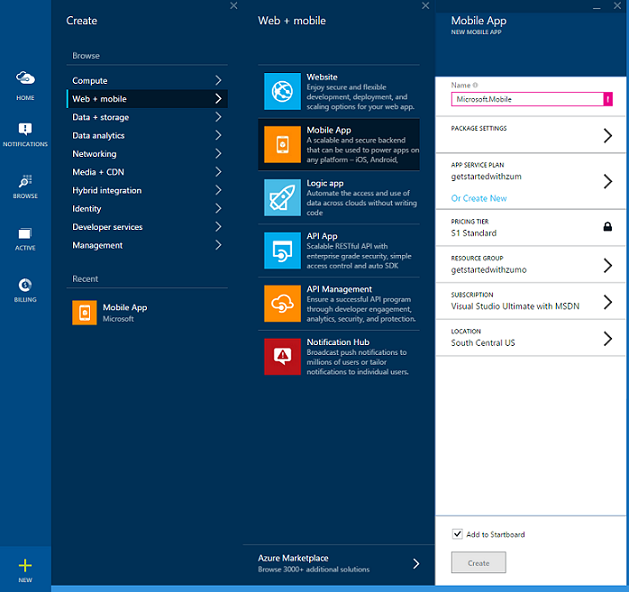
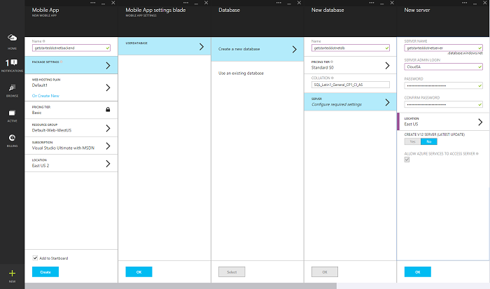
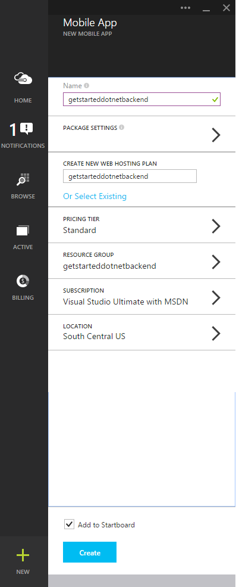

This tutorial shows you how to add a cloud-based backend service to a universal Windows app using an Azure mobile app backend. Universal Windows app solutions include projects for both Windows Store 8.1 and Windows Phone Store 8.1 apps and a common shared project.

The following are screen captures from the completed app:

 Windows Store app

 Windows Phone Store app

## Create a new mobile app backend

Follow these steps to create a new mobile app.

1. Log into the [Azure Portal]. In the bottom left of the window, click **+NEW**. Scroll until you see the **Mobile App** item.

   

   This displays the **New Mobile App** blade.

2. Type a name for your Mobile App. It must be at least 8 characters long and lowercase a to z.

7. Select a region. In this tutorial, we use **South Central US**.

3. Select your subscription.

4. Create a new resource group with the same name as your mobile app.

5. In **Package Settings**, select **USERDATABASE**, you can choose an existing database or create a new one. For creating a new database, type the name of the new **database**, create a new **server**, type the name of that server, then choose a **login name**, which is the administrator login name for the new SQL Database server, type and confirm the password, and click the ok button to complete the process. If selecting an existing database, you will need to provide a **Server Administrator Password**.

   

6. Create a new webhosting plan with the same name as your mobile app.

8. Select a Pricing Tier. In this tutorial, we use **Standard 1**.

   Your new mobile app settings page will now look something like this:

   

9. Click the **Create** button at the bottom of the blade and you should see it starting deployment in the notifications window.

You have now created a new mobile app backend that can be used by your mobile apps.

## Create a new universal Windows app

Once you have created your mobile app backend, you can follow an easy quickstart in the Azure Portal to either create a new app or modify an existing app to connect to your mobile app backend.

In this section you will create a new universal Windows app that is connected to your mobile app backend.

1. In the Azure Portal, click **Mobile App**, and then click the mobile app that you just created.

2. At the top of the blade, click **Add Client** and expand **Windows (C#)**.

   

   This displays the three easy steps to create a Windows Store app connected to your mobile app backend.

3. If you haven't already done so, download and install <a href="https://go.microsoft.com/fwLink/p/?LinkID=257546" target="_blank">Visual Studio Professional 2013</a> on your local computer or virtual machine.

4. Under **Download and run your app and service locally**, select a language for your Windows Store app, then click **Download**.

   This downloads a solution contains projects for both the mobile app backend and for the sample _To do list_ application that is connected to your mobile app backend. Save the compressed project file to your local computer, and make a note of where you save it.

## Test the mobile app

The mobile app project lets you to run your new mobile app backend locally. This makes it easy to debug your service code before you even publish it to Azure.

1. On your Windows PC, extract project you downloaded earlier, and then open it in Visual Studio.

2. Select the bottom project which should be your Mobile App name with Service at the end of it. Press the **F5** key to download the nuget packages, build the project and start the mobile app backend locally. When you run your mobile app client, pointed at localhost, it will talk to your local backend.

## Publish your mobile app backend

1. In Visual Studio, right-click the project, click **Publish** > **Publish Web** > **Microsoft Azure Web Apps**.

2. Sign in with Azure credentials and select your service from **Existing Web Apps** (your service may have a "-code" suffix.) Visual Studio downloads your publish settings directly from Azure. Finally, click **Publish**.

## Run the Windows app

Now that the mobile app backend is published and the client is connected to the remote mobile app backend hosted in Azure, we can run the app using Azure for item storage.

Go back to Visual Studio and select the Shared Code Client App project (it is named like `<your app name>.Shared`)

1. Expand the **App.xaml** file and then open the **App.xaml.cs** file. Locate the declaration of the `MobileService` member which is initialized with a localhost URL. Comment out this declaration (with `CTRL+K,CTRL+C`) and uncomment the declaration (`CTRL+K,CTRL+U`) that connects to your hosted service:

        // This MobileServiceClient has been configured to communicate with your local
        // test project for debugging purposes.
        //public static MobileServiceClient MobileService = new MobileServiceClient(
        //    "http://localhost:58454"
        //);

        // This MobileServiceClient has been configured to communicate with the Azure Mobile Service and
        // Azure Gateway using the application key. You're all set to start working with your Mobile Service!
        public static MobileServiceClient MobileService = new MobileServiceClient(
            "https://mymobileapp-code.azurewebsites.net",
            "https://myresourcegroupgateway.azurewebsites.net/Microsoft.Azure.AppService.ApiApps.Gateway",
            "XXXX-APPLICATION-KEY-XXXXX"
        );

2. Press the F5 key to rebuild the project and start the Windows Store app, which should be your default start up project.

2. In the app, type meaningful text, such as *Complete the tutorial*, in the **Insert a TodoItem** textbox, and then click **Save**.

	

	This sends a POST request to the new mobile app backend hosted in Azure.

3. Stop debugging and change the default start up project in the universal Windows solution to the Windows Phone Store app (right click the `<your app name>.WindowsPhone` project and click **Set as StartUp Project**) and press F5 again.

	

	Notice that data saved from the previous step is loaded from the mobile app after the Windows app starts.

## Review the Mobile App sync code

Mobile App offline sync allows end users to interact with a local database when the network is not accessible. To use these features in your app, you initialize `MobileServiceClient.SyncContext` to a local store. Then reference your table through the `IMobileServiceSyncTable` interface.
This section walks through the offline sync related code in `QSTodoService.cs`.

1. In Visual Studio, open the project that you completed in the [Get Started with Mobile Apps] tutorial. Open the file `QSTodoService.cs`.

2. Notice the type of the member `todoTable` is `IMobileServiceSyncTable`. Offline sync uses this sync table interface instead of `IMobileServiceTable`. When a sync table is used, all operations go to the local store and are only synchronized with the remote service with explicit push and pull operations.

    To get a reference to a sync table, the method `GetSyncTable()` is used. To remove the offline sync functionality, you would instead use `GetTable()`.

3. Before any table operations can be performed, the local store must be initialized. This is done in the `InitializeStoreAsync` method:

        public async Task InitializeStoreAsync()
        {
            var store = new MobileServiceSQLiteStore(localDbPath);
            store.DefineTable<ToDoItem>();

            // Uses the default conflict handler, which fails on conflict
            await client.SyncContext.InitializeAsync(store);
        }

    This creates a local store using the class `MobileServiceSQLiteStore`, which is provided in the Mobile App SDK. You can also a provide a different local store implementation by implementing `IMobileServiceLocalStore`.

    The `DefineTable` method creates a table in the local store that matches the fields in the provided type, `ToDoItem` in this case. The type doesn't have to include all of the columns that are in the remote database--it is possible to store just a subset of columns.

<!--     This overload of `InitializeAsync` uses the default conflict handler, which fails whenever there is a conflict. To provide a custom conflict handler, see the tutorial [Handling conflicts with offline support for Mobile Services].
 -->
4. The method `SyncAsync` triggers the actual sync operation:

        public async Task SyncAsync()
        {
            try
            {
                await client.SyncContext.PushAsync();
                await todoTable.PullAsync("allTodoItems", todoTable.CreateQuery()); // query ID is used for incremental sync
            }

            catch (MobileServiceInvalidOperationException e)
            {
                Console.Error.WriteLine(@"Sync Failed: {0}", e.Message);
            }
        }

    First, there is a call to `IMobileServiceSyncContext.PushAsync()`. This method is a member of `IMobileServicesSyncContext` instead of the sync table because it will push changes across all tables. Only records that have been modified in some way locally (through CUD operations) will be sent to the server.

    Next, the method calls `IMobileServiceSyncTable.PullAsync()` to pull data from a table on the server to the app. Note that if there are any changes pending in the sync context, a pull always issues a push first. This is to ensure all tables in the local store along with relationships are consistent. In this case, we have called push explicitly.

    In this example, we retrieve all records in the remote `TodoItem` table, but it is also possible to filter records by passing a query. The first parameter to `PullAsync()` is a query ID that is used for incremental sync, which uses the `UpdatedAt` timestamp to get only those records modified since the last sync. The query ID should be a descriptive string that is unique for each logical query in your app. To opt-out of incremental sync, pass `null` as the query ID. This will retrieve all records on each pull operation, which is potentially inefficient.

5. In the class `QSTodoService`, the method `SyncAsync()` is called after the operations that modify data, `InsertTodoItemAsync()` and `CompleteItemAsync`. It is also called from `RefreshDataAsync()`, so that the user gets the latest data whenever they perform the refresh gesture. The app also performs a sync on launch, since `QSTodoListViewController.ViewDidLoad()` calls `RefreshDataAsync()`.

    Because `SyncAsync()` is called whenever data is modified, this app assumes that the user is online whenever they are editing data. In the next section, we will update the app so that users can edit even when they are offline.

## Update the sync behavior of the app

In this section, you will modify the app so that it does not sync on app launch or on the insert and update operations, but only when the refresh gesture is performed. Then, you will break the app connection with the mobile backend to simulate an offline scenario. When you add data items, they will be held in the local store, but not immediately synced to the mobile backend data store.

1. Open `QSTodoService.cs`. Comment out the calls to `SyncAsync()` in the following methods:

    - `InsertTodoItemAsync`
    - `CompleteItemAsync`
    - `RefreshAsync`

    Now, `RefreshAsync()` will only load data from the local store, but will not connect to the app backend.

2. In `QSTodoService.cs`, change the definition of `applicationURL` to point to an invalid mobile app URI:

        const string applicationURL = @"https://your-service.azurewebsites.xxx/"; // invalid URI

3. To ensure that data is synchronized when the refresh gesture is performed, edit the method `QSTodoListViewController.RefreshAsync()`. Add a call to `SyncAsync()` before the call to `RefreshDataAsync()`:

        private async Task RefreshAsync ()
        {
            RefreshControl.BeginRefreshing ();

            await todoService.SyncAsync();
            await todoService.RefreshDataAsync (); // add this line

            RefreshControl.EndRefreshing ();

            TableView.ReloadData ();
        }

4. Build and run the app. Add some new todo items. These new items exist only in the local store until they can be pushed to the mobile backend. The client app behaves as if is connected to the backend, supporting all create, read, update, delete (CRUD) operations.

5. Close the app and restart it to verify that the new items you created are persisted to the local store.

## Update the app to reconnect your mobile backend

In this section you will reconnect the app to the mobile backend, which simulates the app coming back to an online state. When you perform the refresh gesture, data will be synced to your mobile backend.

1. Open `QSTodoService.cs`. Remove the invalid mobile app URL and add back the correct URL and app key.

2. Rebuild and run the app. Notice that the data has not changed, even though the app is now connected to the mobile backend. This is because this app always uses the `IMobileServiceSyncTable` that is pointed to the local store.

3. Connect to your backend SQL database to view the data that has been stored. In Visual Studio go to **Server Explorer** -> **Azure** -> **SQL Databases**. Right click your database and select **Open in SQL Server Object Explorer**.

    Notice the data has *not* been synchronized between the database and the local store.

4. In the app, perform the refresh gesture by pulling down the list of items. This causes the app to call `RefreshDataAsync()`, which in turn calls `SyncAsync()`. This will perform the push and pull operations, first sending the local store items to the mobile backend, then retrieving new data from the backend.

5. Refresh your database view and confirm that changes have been synchronized.
